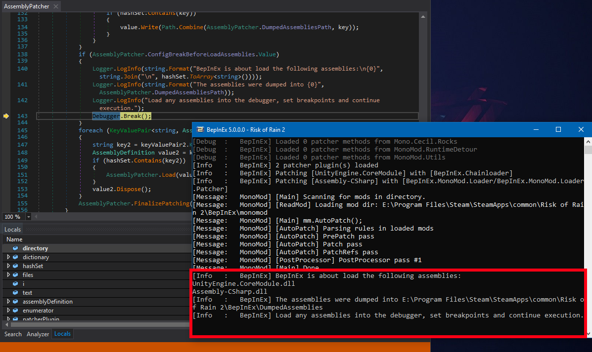
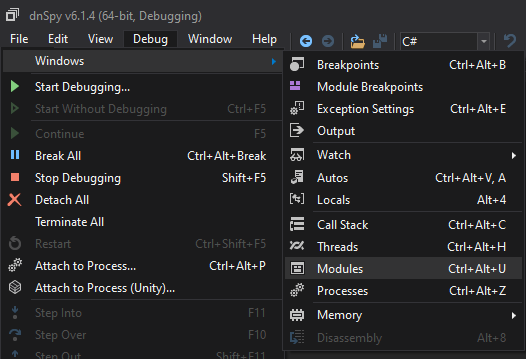
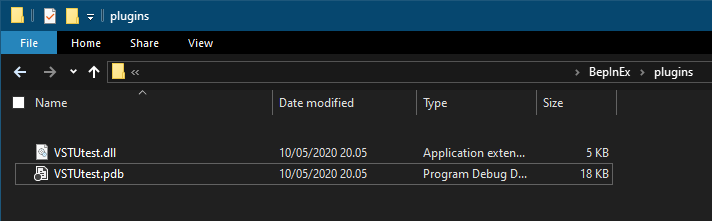

Debugging BepInEx plugins can pose a challenge depending on the game and the plugin.  
Currently there are two ways to debug plugins and Unity games

1. Using dnSpy and its debug builds of the Mono runtime
2. Converting the game to debug build and using Visual Studio Tools for Unity (or Rider's Unity extension) 

# Debugging with dnSpy

## Turning the game into a debug build

> [!NOTE]
> This guide's step is mainly a basic overview of what to do.
> For a full guide on turning your game into a debug build, check out [the offical dnSpy's guide on this topic.](https://github.com/0xd4d/dnSpy/wiki/Debugging-Unity-Games#debugging-release-builds).

First, the game's mono runtime has to be swapped to one that supports debugging with dnSpy.  
For that, you need to know the Unity version your game has been built against.  
You can do that by checking file properties of the game EXE or by running BepInEx, 
which will log the Unity version of the game in the console (or into `BepInEx/LogOutput.txt`):

```
[Message:   BepInEx] BepInEx 5.0.1.0 - <Game Name>
[Info   :   BepInEx] Running under Unity v5.4.0.6710170
[Info   :   BepInEx] CLR runtime version: 2.0.50727.1433
...
```

Next, head to [dnSpy releases](https://github.com/0xd4d/dnSpy/releases) and download one of the debug Mono packages
that **corresponds to the Unity version of your game**:

For example, in the log above Unity version is `5.4.0`, in which case one has to download `Unity-debugging-5.x.zip`.

Open the downloaded archive and locate `mono.dll` that corresponds to your Unity game **version** and 
executable target (32 bit or 64 bit). Finally, locate the same DLL in your game folder and replace it with the one from dnSpy.

## Setting up dnSpy and setting breakpoints

Download the [latest version of dnSpy](https://github.com/0xd4d/dnSpy/releases). You can pick any of the available versions.

Extract the downloaded archive and run dnSpy.

Next, drag the plugins DLLs you want to debug into dnSpy.

> [!NOTE]
> You must select the DLL that is in your `BepInEx` folder, and not the one in your Visual Studio solution!


You can change the settings of dnSpy via `View > Options`.

To set a breakpoint, navigate the assembly you want to debug and right click on the piece of code you want to debug.  
Next, select `Add breakpoint` to set the breakpoint:


Note that some code might not be selectable. In that case you can change dnSpy to show the precise IL code from the dropdown in the top bar.

## Running the game via dnSpy

After you have set the breakpoints, you can start debugging the game.

Select `Debug > Start Debugging` to open up the *Debug Program* dialog.

Change the settings as follows:

* *Debug Engine*: Select **one** of the following:
    * `Unity` if you want dnSpy to start the game for you
    * `Unity (Connect)` if you want to start debugging when the game is on 
* *Executable* (only in `Unity` engine): Locate and select the game's executable from the game's installation directory.
* *Timeout (s)* (only in `Unity` engine): 30. You can optionally set it to higher values if the game loads too slow.
* *IP Address* (only in `Unity (Connect)` engine): Leave it blank
* *Port* (only in `Unity (Connect)` engine): 55555


Finally, press `OK` to start the game (or to attach dnSpy to an already running game).

Wait until the game loads your assembly. If everything worked correctly, the execution will stop on the breakpoint:


From there, you can do same things like in the normal debugger:

* Inspect locals and type members
* Step into, step over, set more breakpoints (via the top bar)
* Modify values (in some cases)

Note that when you step in dnSpy, it steps one IL instruction at a time (in which case one single expression can take multiple steps to move over).

## Debugging patched assemblies

In some cases it is useful to be able to also debug assemblies that have been patched via BepInEx's preloader.  
However, this is very difficult, as the preloader patches and loads assemblies directly in memory, which makes debugging with dnSpy impossible without additional tinkering.

### Using BepInEx `LoadDumpedAssemblies` option

BepInEx includes two new configuration options: `LoadDumpedAssemblies` and `BreakBeforeLoadAssemblies`. With these, it is possible to debug assemblies loaded via the preloader (i.e. Assembly-CSharp).

First [install debug version of mono](#turning-the-game-into-a-debug-build) and [download dnSpy](https://github.com/0xd4d/dnSpy/releases) if you haven't done so yet.

Run the game once in order for BepInEx to generate its full configuration file.  
Then, open to `BepInEx/config/BepInEx.cfg` and edit the the two configuration options to have the following values:

```ini
LoadDumpedAssemblies = true

BreakBeforeLoadAssemblies = true
```

After that [run the game via dnSpy](#running-the-game-via-dnspy).

> [!WARNING]
> **The assemblies in `DumpedAssemblies` must not be opened before debugging!** 
> This is because otherwise BepInEx will not be able to write to the folder!

If everything worked, BepInEx will launch, patch assemblies and automatically break the execution and display a message in console:



Now go to `BepInEx/DumpedAssemblies` (as specified in the console), open patched assemblies you want to debug and set breakpoints.
When you're done, click `Continue` in the top bar to continue execution.

BepInEx will continue loading the patched assemblies. If everything worked, you will eventually hit a breakpoint in the patched assembly:


### Using dnSpy's module view

In Debug mode, dnSpy provides the ability to access all assemblies that are loaded in memory.  
That way you are able to access all 
assemblies that were loaded in memory -- even dynamic assemblies (ones generated by Harmony, for example).

When in debug mode, open the modules window by selecting `Debug > Windows > Modules`



The opened tab shows all modules already loaded into memory:


You can open modules by double-clicking them. This opens them in dnSpy, after which you can 
put breakpoints like you normally would.

Finally, it's possible to put breakpoints for when an assembly has been loaded. 
For that, select `Debug > Windows > Module Breakpoints`. This will open a window into which 
you can put the names of the modules to break on.


# Debugging plugins with Visual Studio Tools for Unity

> [!NOTE]  
> This method is suitable for debugging only BepInEx plugins!
> To debug prelaoder plugins, please refer to the guide above on how to use dnSpy's debug Mono.

While debugging with dnSpy is rather simple, you might want to debug directly in 
Visual Studio while developing. It is possible to debug your plugins with the help of 
Visual Studio Tools for Unity (VSTU).

## Installing required tools

First, you have to convert the game to debug build. To do that, [refer to dnSpy guide on converting the game to pure debug build](https://github.com/0xd4d/dnSpy/wiki/Debugging-Unity-Games#turning-a-release-build-into-a-debug-build).

Next, install VSTU. You can do so in Visual Studio 2019 via Visual Studio Installer.
You can find the component behind `Individual components` tab:


> [!NOTE]  
> Rider provides a similar Unity extension which allows for the same debugging functionality.

## Compiling your project

Next, compile your BepInEx plugin with a `Debug` build. **Make sure that you generate a `.pdb` file!**

Place your BepInEx plugin into `BepInEx\plugins` like you normally would but with the `.pdb` file accompanying it:



## Converting `.pdb` to `.mdb`

Since Unity uses Mono as its .NET runtime, it cannot directly read `.pdb` files which contains the required debug symbols.
Instead, it uses `.mdb` files for the similar task. Because of this, `.pdb` file needs to be converted.

Grab `pdb2mdb` converter (for example, from [NuGet](https://www.nuget.org/packages/Mono.pdb2mdb/) or from [GitHub](https://gist.github.com/jbevain/ba23149da8369e4a966f#file-pdb2mdb-exe)). Put the executable in some folder **except not into BepInEx plugin folder**.

Finally, simply drag-and-drop your plugin DLL file, which will generate the required debug symbols:


After this, you can optionally delete the `.pdb` file as it is not needed.

## Starting debugging

Finally, put breakpoints in Visual Studio however you want and start the game.
When the game has started, you're ready to start debugging.

In Visual Studio, select `Debug > Attach Unity Debugger`:


In the opened dialog, select the game executable and press `OK`:


> [!NOTE]  
> If there is no processes in the list, try pressing `Refresh` -- it might be that the game hasn't loaded in yet.  
> It is also may be because you didn't follow the [dnSpy debug build conversion guide](https://github.com/0xd4d/dnSpy/wiki/Debugging-Unity-Games#turning-a-release-build-into-a-debug-build) properly. 
> In that case, please repeat the steps in that setup guide making sure you use correct Unity version and bitness.

If you've done everything correctly, the debugging session starts and your breakpoints can be hit:

