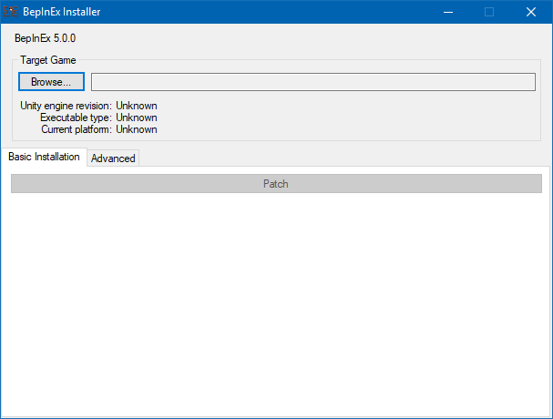
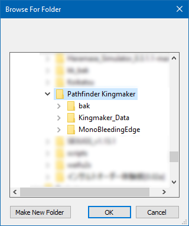
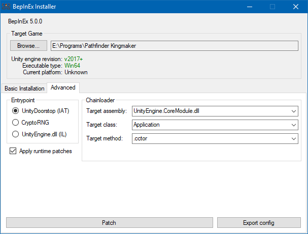
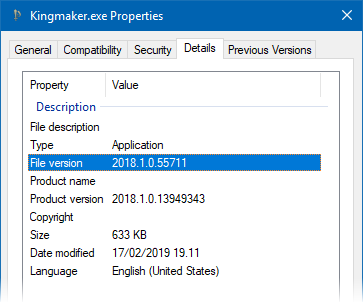

# Installing BepInEx

## Requirements

* *Supported Operating Systems*
    - Windows 7, 8, 8.1 and 10 (both x86 and x64 are supported)
    - Any OS that has support for [Wine](https://www.winehq.org/) (Linux, macOS, FreeBSD, ...)
    - Any OS that has support for [Mono](https://www.mono-project.com/) (Windows, Linux, macOS)
* *Supported Unity games*
    - Unity 4 or newer
    - **The game has to use Mono as the scripting backend. More info in [limitations section](<xref:limitations>).**

> [!IMPORTANT]
> Games built with IL2CPP are not supported!  
> For more information, read the whole explanation in the [limitations section](<xref:limitations>).

## Where to download BepInEx

BepInEx is distributed in two builds: *stable* and *bleeding edge*.

**Stable builds** are available on [GitHub](https://github.com/BepInEx/BepInEx/releases).  
Stable builds are released once a new iteration of BepInEx is considered feature-complete. They have the least bugs, but some newest features might not be available. *It is recommended to use stable builds in most cases*.

**Bleeding edge builds** are available on [BepisBuilds](http://bepisbuilds.dyn.mk/bepinex_be) page.  
Bleeding edge builds are always the latest builds of the source code. Thus they are the opposite to stable builds: they have the newest features and bugfixes available, but usually tend to be the most buggy. Therefore you should use bleeding edge builds only if you are asked to or if you want to preview the upcoming version of BepInEx.

## Installing BepInEx

BepInEx can be installed in two ways: via the installer tool or manually.

# [Using the installer tool](#tab/tabid-1)

1. Download the installer tool.

    [Download BepInEx from one of the available sources.](#where-to-download-bepinex)  
    From the available files, download `BepInEx_Installer_<version>.zip`, where `<version>` is the version of BepInEx you are downloading.

2. Unpack and launch the installer.

    After you have downloaded the installer, unpack it and run `BepInEx.Installer.exe`. That will open the main installer GUI:

    

3. Select the game folder.

    In the GUI, select `Browse...` and select the folder where the game executable is located:

    

    Press `OK` after which the installer will automatically detect game version and try to pick the best configuration for the game.

4. *Optional:* Configure installation options.

    Optionally, you can configure the advanced option of the installation by selecting the `Advanced` tab:

    

    You can get description of every option by hovering your mouse on it.

5. Apply the patch.

    Finally, press `Patch` to install BepInEx. You should now have correct version of BepInEx installed for you.  

# [Installing manually](#tab/tabid-2)

1. Download the correct version of BepInEx.

    [Download BepInEx from one of the available sources.](#where-to-download-bepinex)  
    In the download section, all BepInEx distributions are designated using the following naming convention:  
    
    `BepInEx_<unityVersion>_<arch>_<build>_<version>.zip`

    Each value has different options depending on the game and your OS:

    * `<unityVersion>` -- Version of the Unity that the version supports. Has the following values:
        - `Legacy`: Supports games made in Unity 2017 and earlier.
        - `v2018`: Supports games made in Unity 2018 and later.
    * `arch` -- The OS and architecture this BepInEx was built against. Has the following values:
        - `x86`: For computers running *32-bit Windows*.
        - `x64`: For computers running *64-bit Windows*.
        - `Patcher`: For computers running Linux, macOS and other non-Windows systems.
    * `build` -- *Only in bleeding edge builds.* Specifies the exact commit BepInEx was built against.
    * `version` -- Exact version of BepInEx.

    > [!NOTE]  
    > If you are not sure which Unity version the game runs on, you can check it by right-clicking the game executable and select `Properties -> Details` the file version:  
    >
    > 

2. Extract the contents into the game root.

    After you have downloaded the correct game version, extact the archive into the game folder where the game exectuable is located (so called *game root folder*).

3. *Only for `Patcher` builds:* Run the patcher.

    If you have downloaded and installed the `Patcher` build, run `BepInEx.Patcher.exe` which will permanently patch the game to run BepInEx.

    > [!NOTE]  
    > If you are using a non-Windows system, you might need to run the patcher via mono:  
    > `mono BepInEx.Patcher.exe`

***

## Next: Installing plugins and configuration.

After you're done installing BepInEx, you can start installing and using plugins. Simply put plugins into `BepInEx/plugins` folder in the game folder and you're good to go.

Additionally, you might want to configure plugins and BepInEx itself. For that, please refer to the [configuration guide](<xref:configuration>).